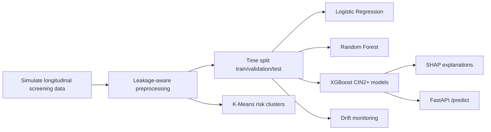

# CerviRisk

CerviRisk is an end-to-end machine learning project for cervical cancer screening risk stratification. It simulates longitudinal HPV/cytology screening records, builds leakage-aware historical features, trains supervised CIN2+ risk models, mines unsupervised risk patterns, explains predictions with SHAP, serves inference through FastAPI, and monitors feature drift.

The project is intended as a compact portfolio-grade pipeline: reproducible synthetic clinical data, time-based validation, model interpretation, API deployment, and monitoring are all runnable from local scripts.

## Quick Start

```bash
python -m venv .venv
source .venv/bin/activate
pip install -r requirements.txt

python src/data_simulator.py
python src/preprocess.py
python src/train.py
python src/clustering.py
python src/explain.py
python src/monitor.py
uvicorn api.app:app --reload
```

Test the API:

```bash
python api/test_request.py
```

## Pipeline



## Design Rationale

CerviRisk is designed to demonstrate practical clinical ML engineering:

- Longitudinal records model repeat screening rather than one-off tabular rows.
- Outcome labels are created from future follow-up windows while features use only information available at the screening date.
- Time-based splits mimic prospective deployment better than random splits.
- Multiple supervised baselines make performance comparisons transparent.
- SHAP and feature importance provide interpretable drivers such as HPV genotype, cytology, and screening history.
- Clustering adds unsupervised cohort discovery for clinical risk pattern exploration.
- FastAPI and drift monitoring connect the model to deployment and post-deployment reliability.

## Repository Layout

```text
api/                 FastAPI inference app and sample request
data/raw/            Simulated raw screening records
data/processed/      Feature matrices, labels, split files, metadata
models/              Trained model artifacts
reports/             Evaluation tables, figures, SHAP outputs, drift logs
src/                 Data simulation, preprocessing, training, monitoring
```

## Notes

The generated data is synthetic and intended only for software and modeling demonstration. It must not be used for clinical decision-making.
