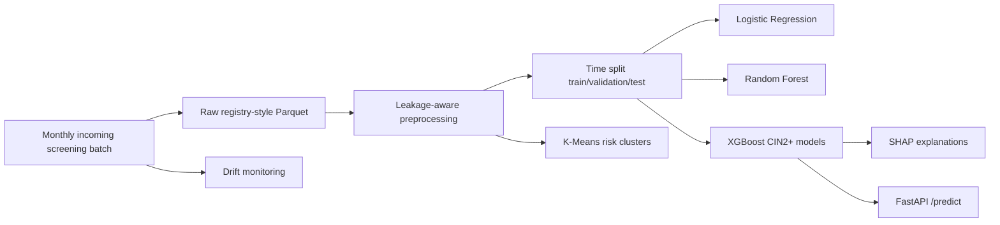

# CerviRisk

CerviRisk is an end-to-end machine learning project for cervical cancer screening risk stratification. It simulates longitudinal HPV/cytology screening records, builds leakage-aware historical features, trains supervised CIN2+ risk models, mines unsupervised risk patterns, explains predictions with SHAP, serves inference through FastAPI, and monitors feature drift.

The project is intended as a compact portfolio-grade pipeline: reproducible synthetic clinical data, time-based validation, model interpretation, API deployment, and monitoring are all runnable from local scripts.

## Quick Start

```bash
python -m venv .venv
source .venv/bin/activate
pip install -r requirements.txt

python src/run_pipeline.py --bootstrap-synthetic
```

The command above runs the self-contained demo from simulated ingestion through drift monitoring. The default synthetic bootstrap generates about 22,000 women and roughly 100,000 longitudinal screening records. In production-style use, `run_pipeline.py` expects raw longitudinal records to already exist from an ingestion layer, database export, or registry file:

```bash
python src/run_pipeline.py --raw-input data/raw/screening_records.parquet
```

To run the stages manually:

```bash
python src/ingest.py --batch-date 2024-01-01
python src/data_simulator.py
python src/preprocess.py --raw-input data/raw/screening_records.parquet
python src/train.py
python src/clustering.py
python src/explain.py
python src/monitor.py
uvicorn api.app:app --reload
```

Test the API:

```bash
python api/test_request.py
```

## Pipeline



## Data Ingestion Cadence

CerviRisk uses simulated monthly batch ingestion. Cervical screening events are generated as registry-style batches under `data/incoming/batch_date=YYYY-MM-DD/`, with a manifest at `data/incoming/manifest.jsonl`.

Monthly cadence is a deliberate design choice: cervical screening programs usually accumulate laboratory, cytology, histology, and registry updates in scheduled batches rather than second-level streams. The same ingestion boundary can be replaced by a real registry export, API pull, or database query. `run_pipeline.py` does not hard-code the data generator; it accepts `--raw-input`, while `--bootstrap-synthetic` is only a local demo convenience.

## Design Rationale

CerviRisk is designed to demonstrate practical clinical ML engineering:

- Longitudinal records model repeat screening rather than one-off tabular rows.
- Outcome labels are created from future follow-up windows while features use only information available at the screening date.
- Time-based splits mimic prospective deployment better than random splits.
- Multiple supervised baselines make performance comparisons transparent.
- SHAP and feature importance provide interpretable drivers such as HPV genotype, cytology, and screening history.
- Clustering adds unsupervised cohort discovery for clinical risk pattern exploration.
- FastAPI and drift monitoring connect the model to deployment and post-deployment reliability.

## Storage Decisions

CerviRisk keeps the demo self-contained, so it uses local files instead of requiring an external database:

- Incoming data: monthly Parquet batches plus a JSONL manifest. This makes ingestion auditable and easy to replay.
- Raw historical data: Parquet, because the data is tabular, typed, columnar, and efficient for batch ML reads.
- Processed features: Parquet split files for train, validation, test, and holdout sets. This avoids recomputing features during repeated model experiments.
- Model artifacts: `joblib` pickle files under `models/`, which is sufficient for a local reproducible repository.
- Reports and monitoring outputs: CSV, JSON, PNG, and HTML under `reports/`, because these are easy for a reviewer to inspect.

A production deployment would likely add PostgreSQL or another operational database for incoming screening events, prediction logs, and audit trails. The project intentionally avoids that dependency so a reviewer can clone and run the complete system locally.

## Serving And Monitoring

Predictions are served by FastAPI:

```bash
uvicorn api.app:app --reload
python api/test_request.py
```

The `/predict` endpoint accepts one screening record with current findings and historical features. It loads the trained XGBoost artifacts and returns 1-year, 3-year, and 5-year CIN2+ risk probabilities.

Data shift is checked after new batches arrive. `src/monitor.py` reads the latest monthly batch from `data/incoming/` unless a specific batch is provided with `--current-batch`. Numeric variables use a KS test, categorical variables use a chi-square test, and `reports/drift_report.json` records which monitored features exceed the drift threshold. In production, repeated drift warnings would trigger data-quality review, subgroup performance checks, and model retraining.

## Scalability by Design

CerviRisk is structured so the same pipeline can scale from a local demo to registry-scale workloads:

- The simulator can be run with `--n-women 500000` and `--chunk-size` to generate 500,000 women and multi-million-row longitudinal screening data without holding the full dataset in memory.
- Raw records can be written as year-partitioned Parquet with `--partition-by-year`, enabling efficient yearly reads for incremental preprocessing and monitoring.
- Feature engineering has both the default Pandas path (`src/preprocess.py`) and a Polars path (`src/preprocess_polars.py`) for faster lazy scans over larger Parquet datasets.
- XGBoost training includes a Dask-XGBoost switch via `CERVIRISK_USE_DASK_XGB=1`, giving the training code a migration path from local execution to a distributed cluster.
- Pipeline schemas mirror NKCx-style cervical screening registry concepts: person identifier, screening date, HPV genotype, cytology, histology, treatment, and longitudinal follow-up outcomes. Connecting real registry data should therefore require replacing the data-reading adapter rather than rewriting the full pipeline.

Large synthetic registry example:

```bash
python src/data_simulator.py \
  --n-women 500000 \
  --chunk-size 25000 \
  --output data/raw/screening_records_partitioned \
  --partition-by-year

python src/preprocess_polars.py \
  --input data/raw/screening_records_partitioned \
  --output data/processed/features_polars_partitioned \
  --partition-by-year

CERVIRISK_USE_DASK_XGB=1 python src/train.py
```

## Repository Layout

```text
api/                 FastAPI inference app and sample request
data/incoming/       Simulated monthly ingestion batches
data/raw/            Simulated raw screening records
data/processed/      Feature matrices, labels, split files, metadata
models/              Trained model artifacts
reports/             Evaluation tables, figures, SHAP outputs, drift logs
src/                 Data simulation, preprocessing, training, monitoring
```

## Notes

The generated data is synthetic and intended only for software and modeling demonstration. It must not be used for clinical decision-making.
