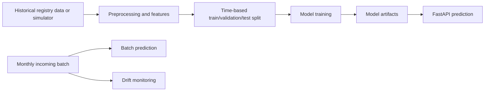
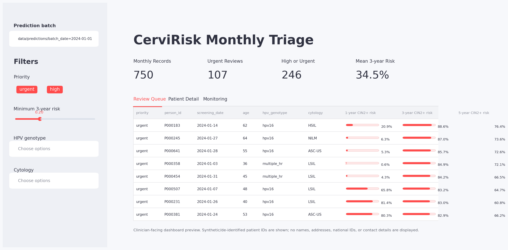

# CerviRisk

CerviRisk is an end-to-end machine learning system for cervical cancer screening risk prediction. It simulates longitudinal HPV/cytology registry data, builds leakage-aware historical features, trains CIN2+ risk models, serves predictions with FastAPI, and monitors monthly data drift.

The project is self-contained: a reviewer can clone it, install dependencies, and run the full training and prediction workflow locally.

## Quick Start

```bash
python -m venv .venv
source .venv/bin/activate
pip install -r requirements.txt

python src/training_pipeline.py --bootstrap-synthetic
python src/prediction_pipeline.py --batch-date 2024-01-01 --inject-demo-drift
```

The first command creates synthetic historical data, preprocesses it, trains models, and writes reports. The second command simulates a monthly incoming batch, generates risk predictions, and writes a drift report.

For real registry-style input, replace the bootstrap step with:

```bash
python src/training_pipeline.py --raw-input data/raw/screening_records.parquet
```

## Main Entry Points

```bash
python src/training_pipeline.py
python src/prediction_pipeline.py --batch-date 2024-01-01
python src/modeling/tune.py --n-iter 12
uvicorn src.serving.app:app --reload
python src/serving/test_request.py
streamlit run src/dashboard/app.py
```

Important tuning defaults live in `src/config.py`, including cohort size, split years, primary target, XGBoost parameters, clustering settings, and drift thresholds.

## Pipeline



## Model Training And Tuning

`src/modeling/train.py` benchmarks three supervised models for the primary 3-year CIN2+ target:

- Logistic Regression
- Random Forest
- XGBoost

It saves the best validation model as `models/best_cin2_3yr.pkl`. For the deployed 1-year, 3-year, and 5-year risk endpoints, the pipeline also trains XGBoost models and saves:

- `models/xgb_cin2_1yr.pkl`
- `models/xgb_cin2_3yr.pkl`
- `models/xgb_cin2_5yr.pkl`

XGBoost parameters are defined in `src/config.py`. To run a time-series hyperparameter search:

```bash
python src/modeling/tune.py --target outcome_cin2_3yr --n-iter 20
```

Outputs:

- `reports/tuning_results.csv`
- `reports/best_xgb_params.json`

After tuning, copy the selected parameters into `src/config.py` and rerun `src/training_pipeline.py`.

## Serving And Monitoring

FastAPI exposes a single-record prediction endpoint for system-to-system serving:

```bash
uvicorn src.serving.app:app --reload
```

Test it:

```bash
python src/serving/test_request.py
```

The clinician-facing view is the monthly triage dashboard:

```bash
streamlit run src/dashboard/app.py
```

It reads the latest monthly predictions, highlights urgent/high-risk patients, shows recommended review actions, and displays the drift report.

The dashboard is designed for clinicians reviewing a monthly screening batch. It is not a patient-facing page. The demo uses synthetic, de-identified patient IDs only; names, addresses, national identifiers, contact details, and other direct personal identifiers are not displayed. A real deployment should add authentication, role-based access, audit logging, and local privacy-compliance controls before connecting to clinical data.



Monthly predictions are generated by:

```bash
python src/prediction_pipeline.py --batch-date 2024-01-01
```

This always runs drift monitoring and writes `reports/drift_report.json`. Numeric drift uses a KS test; categorical drift uses a chi-square test.

## Storage Choices

- `data/incoming/`: monthly Parquet batches plus `manifest.jsonl`
- `data/raw/`: historical registry-style Parquet
- `data/processed/`: feature matrices and split files
- `models/`: trained model artifacts
- `reports/`: metrics, feature importance, tuning results, SHAP plots, drift logs

The demo uses flat files so it can run locally without external services. A production version would likely add a database for incoming events, prediction logs, and audit trails.

## Scalability

- Simulator supports large cohorts via `--n-women` and `--chunk-size`
- Parquet partitioning supports efficient year-level reads
- Feature engineering has both Pandas and Polars implementations
- XGBoost can switch to Dask mode with `CERVIRISK_USE_DASK_XGB=1`

Example:

```bash
python src/ingestion/simulator.py --n-women 500000 --chunk-size 25000 --output data/raw/screening_records_partitioned --partition-by-year
python src/features/preprocess_polars.py --input data/raw/screening_records_partitioned --output data/processed/features_polars_partitioned --partition-by-year
CERVIRISK_USE_DASK_XGB=1 python src/modeling/train.py
```

## Repository Layout

```text
src/
  config.py
  training_pipeline.py
  prediction_pipeline.py
  ingestion/      Data simulation and monthly batch ingestion
  features/       Preprocessing and feature engineering
  modeling/       Training, tuning, clustering, explanation, batch prediction
  serving/        FastAPI app and request smoke test
  dashboard/      Clinician-facing monthly triage dashboard
  monitoring/     Drift checks

data/             Local input and generated data files
models/           Trained model artifacts
reports/          Metrics, plots, tuning output, and drift reports
```

## Note

All generated records are synthetic and intended only for software engineering and modeling demonstration. They must not be used for clinical decision-making.
